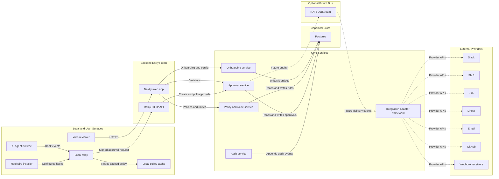
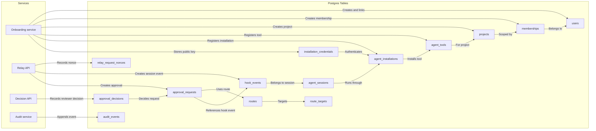
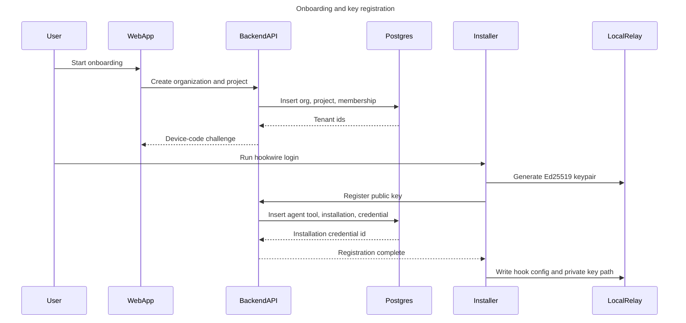
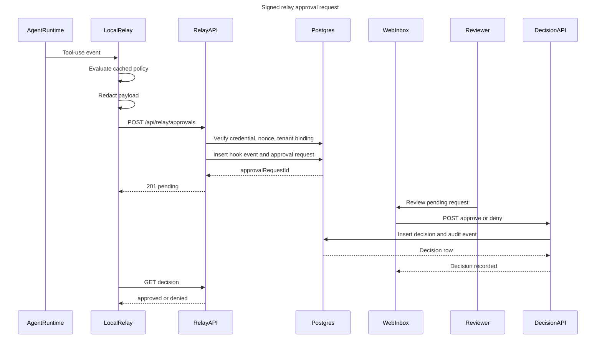
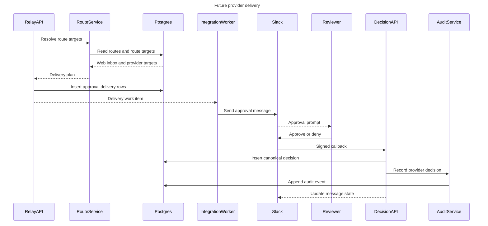

# Hookwire Diagrams

These Mermaid diagrams describe the current MVP architecture and the intended v1 flows. They are kept in source control so GitHub can render them in pull requests and documentation.

## System Architecture

## Canonical Identity and Approval Records

## Onboarding and Key Registration

## Signed Relay Approval Request

## Future External Integration Delivery

